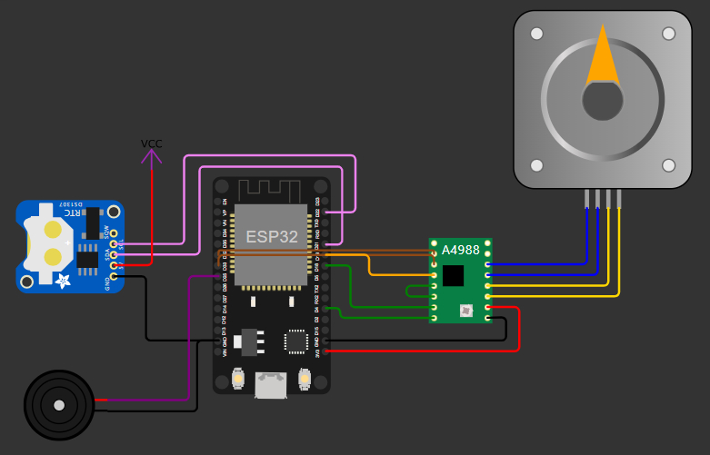

# Hora do Papá
Hora do Papá is my project for an automatic pet feeder for my dogs.

This repository contains the PlatformIO project, utilizing an ESP32 board with the Arduino framework. Instructions for building and uploading the project can be found in the [documentation](https://docs.platformio.org/en/latest/what-is-platformio.html) provided by PlatformIO.

For those preferring another IDE, the embedded code can be accessed in `src/main.cpp`, while all library dependencies are listed in `platformio.ini`, along with other specifications.

## Functionality
The ESP32 controls a stepper motor based on pre-set activation times, leveraging the Real-Time Clock (RTC) module to obtain the current time accurately.

A simplified schematic of the project is outlined in sequence. You can simulate it using [Wokwi](https://wokwi.com/projects/362607709066572801).

## Bill of materials
While the complete project documentation will be provided elsewhere, for this simplified circuit, you will need:
- ESP32 board (for this initial version, an Arduino board is also compatible)
- NEMA 17 or another suitable stepper motor
- A4988 stepper motor driver
- DS1307 RTC module
- Additional power supply may be required for the stepper motor

## Future work
In the upcoming version, I plan to implement WiFi connectivity to allow remote access to the ESP32. This will enable users to add/modify activation times or manually trigger the feeding system.