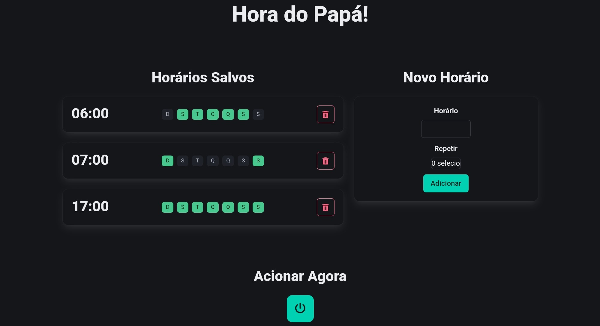

# Hora do Papá
Hora do Papá is my project for an automatic pet feeder for my dogs.

This repository contains the PlatformIO project, utilizing an ESP32 board with the Arduino framework. Instructions for building and uploading the project can be found in the [documentation](https://docs.platformio.org/en/latest/what-is-platformio.html) provided by PlatformIO. The project uses the SPIFFS filesystem to upload and manage the files, so it's important not to forget uploading them manually once. You can check how to do it using PlatformIO at the excellent [tutorial](https://randomnerdtutorials.com/esp32-vs-code-platformio-spiffs/) from Random Nerd Tutorials blog.

For those preferring another IDE, the main code can be accessed in `src/main.cpp`, while all library dependencies are listed in `platformio.ini`, along with other specifications. The GUI files and the database one can be found at the `data` folder.

## v2.0
New features:
- Control of the activation times through a GUI
- Web Server to host the GUI and to connect with the main system

## Functionality
The ESP32 controls a stepper motor based on the activation times saved at `bd.json`, leveraging the Real-Time Clock (RTC) module to obtain the current time accurately. You can access the GUI to check the actives activation times, to add new ones or to remove existent ones, as shown in sequence.

In this version, it's not possible to modify existent activation times, nor to set a activation time that does not repeat itself. Also, the "Ativar Agora" (Activate Now) button is not implemented.

A simplified schematic of the project circuit is outlined in sequence. You can simulate it using [Wokwi](https://wokwi.com/projects/362607709066572801).

## Bill of materials
While the complete project documentation will be provided elsewhere, for this simplified circuit, you will need:
- ESP32 board
- NEMA 17 or another suitable stepper motor
- A4988 stepper motor driver
- DS1307 RTC module
- Additional power supply may be required for the stepper motor

## Future work
In the upcoming version, I plan to use Google Firebase to store the data and to allow access to the GUI using not only the local network.